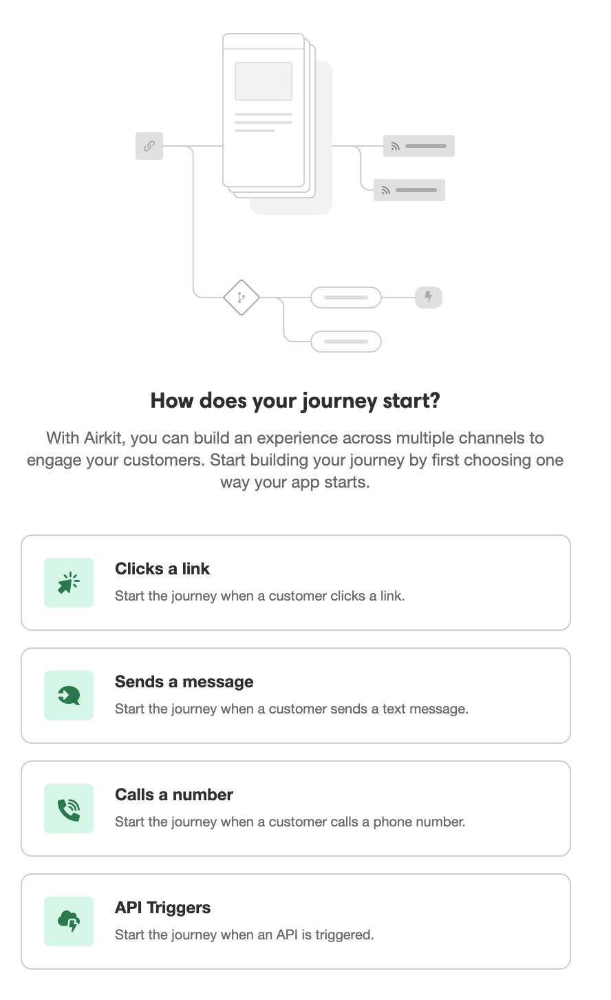

The Journey Model describes a means of conceptualizing how Airkit keeps track of where users are within the flow of the application, as well as what they've done, entered, or requested in the process of going through it.


Whenever someone uses your app, they're going on a guided **Journey**, a term in Airkit used interchangeably with "Session". Keeping track of what each user has done and where they're going is an important part of tailoring the experience for them, especially if the app spans multiple channels. Additionally, by automatically distinguishing each **Journey** as a separate entity, Airkit's Journey Model makes it possible to gather information regarding how a user is engaging with an application, even if nothing else is known about the user themselves.

<details>
  <summary> In layman's terms, what is a "user's Journey"?</summary>


<br />

A user's **Journey** – capital J – has a very specific, technical meaning within Airkit. However, if we abstract away the more technical details regarding how information is stored and how an individual **Journey** is recognized, a user's **Journey** is roughly analogous to a user's journey – lowercase j – while interacting with any service. Consider, for instance, the journey you go through while going out to eat at a restaurant, spanning from the moment you first set foot in the restaurant to the moment you return home.

If you enter the restaurant, find there are no available tables, and get put on a waiting list? That's part of your journey, as is the part where your host remembers you and calls your name when a table is ready. When you're given a menu, select food, and specify that you want extra chipotle aioli? That's part of your journey, and so is the part where the waiter brings you the food you ordered, extra aioli and all. If you exit the restaurant, only to get chased down by the waiter because you left your wallet on the table? That's part of your journey: your journey encompasses all interactions you have with any aspect of the restaurant pertaining to this particular visit. 


Importantly, your journey does *not* span anything beyond that. If you return to the restaurant two days later, when an entirely different waitstaff is working and no one remembers you, this does not count as an extension of your existing journey. No aspect of the restaurant system recognizes you or knows what you ordered two days ago. When you return to the restaurant, this counts as beginning an entirely new journey.


A **Journey** in Airkit follows the same principles.

</details>

## Defining a Journey


An Airkit **Journey** starts when a user first begins to go through the flow of an app. This can happen in a multitude of ways, but regardless of how a **Journey** starts, it spans all of the user's interactions with that app, across all relevant channels, as long as the app has some way of recognizing the **Journey**. This is done by associating a **Journey** with unique identifiers. By default, Airkit provides the first identifier automatically: as soon as a Journey begins, it is assigned a unique ID (the "session ID") as an identifier. This allows every **Journey** to be immediately considered as its own separate entity, even if nothing else is known about the person embarking on it.

<details>
  <summary> Where is the session ID stored? </summary>

<br />

The session ID is automatically-created session-level variable, accessible as ```session.id```. It is stored as a [string](ref:the-text-variable-data-type).

For more on what session-level variables are and now they are used in Airkit, see documentation on [Variable Scopes](doc:variable-scopes).

</details>

If an app is sufficiently simple, automatically-assigned identifiers might be the only pieces of data associated with **Journeys** through that app. Similarly, a user might exit an app before providing any information that might serve as unique identifier. In both cases, it is still valuable to keep track the Journey via its default identifier, for the purposes of data analytics if nothing else. You might want, for instance, to compare the number of **Journeys** started with the number of **Journeys** completed.


However, the real power of the Journey Model lies in how it allows a single **Journey** to span multiple channels by collecting relevant information and storing it in the form of identifiers. The exact nature of this relevant information varies, though emails and phone numbers are among the most common. If a **Journey** begins with a user making an appointment via a web app, and then continues through the user getting a confirmation text, this is made possible only because the user's phone number was in some way tied to their **Journey**. It wouldn't work otherwise – a phone number is required to receive a confirmation text, and if you send one, you want to ensure it's precisely confirming the appointment that was made online.


Identifying a **Journey** by information known by the user also allows said user to pick up their **Journey** where they left off should they leave – by design, force, or accident – in the middle of it. This is technically possible even when a **Journey** is identified only by automatically-assigned IDs. For example, in the case of web apps, an initial identifier is stored in the URL path. (For security reasons, this identifier is **not** the same as the session ID.) If a user records the URL path associated with the Journey they started – which is, critically, distinct from the more general URL they went to in order to start their Journey in the first place – they can resume their **Journey** where they left off. However, if the user did not take note of the identifier in the URL path before exiting the web app, as is more likely the case, they will have no way of finding it out, and will therefore not be able to access that initial **Journey** upon their return. They will be forced to start a new **Journey**, and repeat any aspects of it that they have already gone through.

<details>
  <summary> What is the difference between a URL that resumes a Journey and URL that begins a Journey? </summary>

<br />

A Starting Link triggers the start of a **Journey**. It can be used any number of times to begin any number of **Journeys**. 

A Canvas Link leads to a web page associated with an existing **Journey**. It is capable of doing so because it contains a unique **Journey** identifier in the URL path. 

Upon navigating to a starting link and beginning a **Journey**, the change from Starting Link to Canvas Link will be reflected in the address bar of the web browser, as an identifier becomes part of the path parameters. (Should you endeavor to send someone a link to an Airkit app, be mindful of which URL you are sending. You cannot send someone a Starting Link by copy/pasting the URL from your address bar.)

Canvas Links can be sent via reminder texts, prompting users to return to a half-finished **Journey** to finish what has been started without loosing previous progress. For more on how this is done, see [Sending Journey Links via Chat Bot](doc:sending-journey-links-via-chat-bot).

</details>


## Starting a Journey


A **Journey** starts whenever a user begins engaging with or being engaged by an Airkit app; this is when they are automatically assigned a unique ID as an identifier. You can start a **Journey** upon a potential user clicking a link, sending a text message, or calling a phone number. A **Journey** might also start when an API is triggered. Choosing a way for users to begin their **Journey** is one of the first things you do when creating an app in Airkit:



A single app might allow users to begin their **Journeys** through it via multiple channels. While each individual **Journey** can only begin once, different users accessing the app might begin their interactions with it – and thus their **Journeys** – in different ways. An app might, for example, allow users to begin their **Journeys** via either sending a text or making a phone call. 


For a more detailed discussion on how to start Journeys from multiple channels, check out [Sending Journey Links via Chat Bot](https://support.airkit.com/docs/sending-journey-links-via-chat-bot).


## Ending a Journey


Journeys don't last forever. By default, a **Journey** ends after thirty days, although this default can be changed in the [Configuration Builder](https://support.airkit.com/docs/configuration-builder), modified dynamically with the [Extend Journey Expiration Time Action](https://support.airkit.com/reference/the-extend-journey-expiration-time-action), or overridden by the [End Journey Action](https://support.airkit.com/reference/the-end-journey-action). The existence of this default is largely a matter of efficiency. Consider, for instance, cases where a user accidentally exits an app before reaching the end or providing any information that might serve as unique identifier. If the only way to end a **Journey** was by explicitly ending it once the user had successfully completed what they set out to do, this **Journey** would remain active but untouchable, in limbo, forever. With this default expiration, it only stays in this limbo for thirty days.


Once a **Journey** is over, a user cannot return to it; if they access the app again, they will begin a **Journey** anew.
